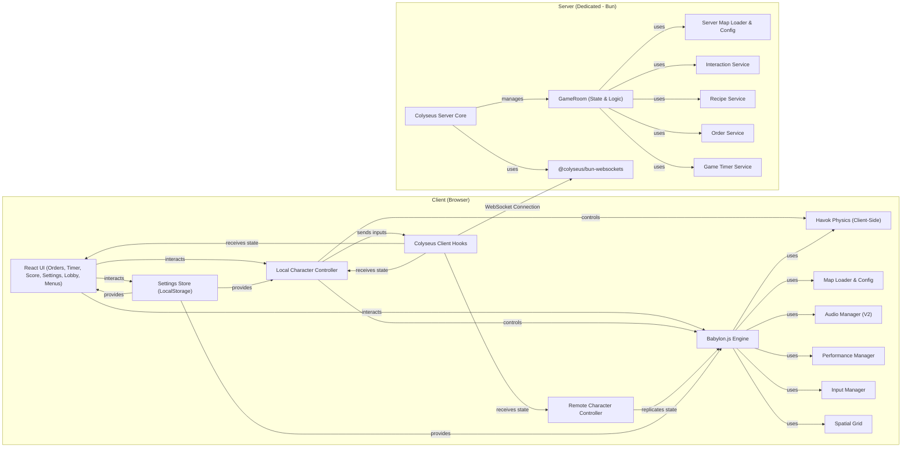

# Delixia 🍣


## 📖 Description

**Delixia** is an online multiplayer cooking game inspired by the *Overcooked* series. Play as a chef cooperating with others in a **Japanese-themed kitchen** to prepare and serve dishes against the clock. Take orders, gather ingredients, process and combine them according to recipes, plate the final dish, and deliver it to the correct customer seat. The game runs on a **dedicated server** using Colyseus for real-time synchronization.

<p align="center">
  <a href="https://delixia.pages.dev/" target="_blank">
    
  </a>
  &nbsp;&nbsp;&nbsp;
  <a href="https://delixia.triformine.dev/" target="_blank">
    
  </a>
</p>

## ✨ Key Features

*   **Online Multiplayer**: Real-time cooperative gameplay powered by Colyseus.
*   **Japanese Kitchen Map**: A vibrant, multi-level kitchen environment with specific interactable stations.
*   **Recipe System**: Prepare various sushi dishes (Onigiri, Ebi Nigiri, Salmon Nigiri, Sea Urchin Rolls) following specific steps and ingredient combinations. Supports upgrading items on workstations.
*   **Order Management**: Receive orders with timers, assigned to specific customer seats. UI visualizes required steps.
*   **Dynamic UI**: Real-time updates for orders (with visual recipe steps), timer, score, and held items.
*   **Physics-Based Movement**: Character control using Havok physics for movement, jumping, and ground detection. Includes boundary walls.
*   **Configurable Settings**: Adjust controls (keybindings, mouse sensitivity X/Y, invert Y), graphics (quality preset, FOV, FPS counter toggle), and audio (master/music/SFX volumes). Settings saved to LocalStorage.
*   **In-Game Settings Menu**: Access common options quickly via a toggleable menu (default Esc key) without leaving the game. Pointer lock release also triggers it.
*   **Lobby System**: Join existing public/private rooms via a searchable Room List or create new rooms (public/private with password). Copy Room ID for easy sharing. Quick Play option available.
*   **Map Verification**: Client checks its map configuration hash against the server's hash upon joining to ensure consistency.
*   **Performance Optimizations**: Mesh instancing, optimized shadows (CascadedShadowGenerator), hardware scaling based on quality settings, spatial grid for interaction detection.
*   **Item & Interaction System**: Defined ingredients/plates, visual configurations for holding/placing items, dedicated interaction logic for different station types (Stock, Oven, Chopping Board, Trash, Serving Board, Customer Seat).
*   **Serving & Cleanup**: Serve plated dishes to correct seats. Dirty plates appear after serving and must be trashed.
*   **Audio**: Spatially aware footstep sounds, interaction sounds (pickup, trash, complete order, error), processing sounds (oven loop), timer ticking, background music, volume controls. Audio context unlocked on interaction.
*   **Visuals**: Character animations (Idle, Walk, Jump, Fall, Land, Dance), particle effects (sparkles, cooking, spawn/despawn), fog, skybox, reflection probes, character mesh fading when camera is too close.

## 🎮 Core Gameplay Mechanics

1.  **Order Management**: Orders appear in the UI, each tied to a customer seat (chair) and a timer ⏱️. The UI visualizes the required ingredients and processing steps needed for the final dish.
2.  **Ingredient Procurement**: Grab base ingredients (Rice 🍚, Nori, Salmon 🐟, Ebi 🍤, Sea Urchin) from designated Stock points (crates/fridges).
3.  **Food Preparation**:
    *   **Processing**: Stations like the Oven transform ingredients over time (e.g., Rice -> Cooked Rice). Server manages timers; visual effects (particles, progress bar) are shown client-side.
    *   **Combining**: Use the Chopping Board to combine ingredients according to recipes (e.g., Cooked Rice + Nori = Onigiri). Some recipes *upgrade* existing items already on the board by adding more ingredients (e.g., Onigiri + Salmon -> Salmon Nigiri).
4.  **Plating & Serving Boards**:
    *   Obtain clean Plates from a Plate Stock.
    *   Place finished dishes onto a Plate (usually on a Serving Board or directly in hand if holding a plate).
    *   Use Serving Boards as intermediate holding spots for plates and/or final dishes, allowing transfer between players.
5.  **Serving & Scoring**: Deliver the correct plated dish to the customer seat (chair interactable) associated with the order before the timer expires to score points. Serving the wrong dish results in a penalty and leaves a dirty plate.
6.  **Dirty Plates**: After serving (correctly or incorrectly), the chair receives a dirty plate that must be picked up and disposed of in the Trash before a new order can be served there.
7.  **Trash**: Dispose of unwanted ingredients, plates (clean or dirty) in the Trash bin.
8.  **Game Phases**:
    *   **Lobby**: Players gather in a waiting room before the game starts. The host can initiate the game. Room ID can be copied for invites.
    *   **Playing**: The main gameplay phase where players cooperate to fulfill orders against the round timer.
    *   **Finished**: Game ends when the timer runs out; a Game End screen displays the final score, accompanied by a confetti 🎉 celebration.
9.  **Teamwork**: Coordinate actions with other players effectively – passing ingredients, managing stations, and delivering orders – to maximize the score.

## 🗺️ Available Map

*   **Japanese Kitchen**: Prepare **Onigiri**, **Ebi Nigiri**, **Salmon Nigiri**, and **Sea Urchin Rolls** in a dynamic, multi-level Japanese-style kitchen featuring various workstations and customer seating areas.

## ✨ Assets and Inspirations

Assets (3D models, textures, sounds) are sourced from **royalty-free** providers. A big thank you to all creators who share their resources! **Delixia** is heavily inspired by the *Overcooked* series, focusing on online cooperation and fast-paced gameplay in a friendly atmosphere.

---

## 🔧 Detailed Technical Implementation

The game utilizes a client-server architecture for real-time online multiplayer gameplay.

### Overall Architecture



### 3D Engine & Physics (Babylon.js - Client-Side)

*   **3D Rendering**: Powered by **Babylon.js**. Attempts **WebGPU** first, falling back to **WebGL**.
*   **Asset Instantiation**: Map objects (`MapLoader.ts`) and ingredient/item models (`IngredientLoader.ts`) are loaded once and efficiently instantiated/cloned to optimize memory and performance.
*   **Physics**: **Havok Physics** engine integrated client-side. `LocalCharacterController` uses shape casting and collision manifold analysis for robust movement, ground checks (`CharacterSupportedState`), and slope handling. Invisible boundary walls prevent players from falling off the map.
*   **Shadows & Performance**: `CascadedShadowGenerator` provides optimized shadows. `PerformanceManager` adjusts shadow quality (map size, blur, filtering) and hardware scaling based on user settings ('Low', 'Medium', 'High') and displays an optional FPS counter.
*   **Environment**: Skybox and `ReflectionProbe` for Image-Based Lighting (IBL). Exponential fog effect applied.
*   **Loading**: Custom loading screen (`CustomLoadingScreen` in `BabylonScene.tsx`) shows progress via `AssetsManager`.
*   **Audio**: `AudioManager` utilizes **Babylon.js Audio Engine v2**, managing sound loading, playback (SFX & Music), volume categories (Master/Music/SFX) from settings, spatial audio for footsteps/interactions, and audio context unlocking.
*   **Input**: `InputManager` handles canvas focus, pointer lock acquisition/release, and unlocks the audio context on user interaction. Pointer lock release automatically pauses the game and shows the In-Game Settings menu.

### Networking & Multiplayer (Colyseus - Client & Server)

*   **Server**: Dedicated **Colyseus** server running on **Bun** (`@colyseus/bun-websockets`) hosted at `delixia-server.triformine.dev`. Provides high I/O performance.
    *   **Dev Tools**: Includes **Playground** (`http://localhost:2567`) and **Monitor** (`http://localhost:2567/monitor`, login `admin:admin`) for local development.
*   **State Synchronization**: Uses Colyseus `Schema` (`GameRoomState`, `Player`, `InteractableObjectState`, `Order`) for efficient real-time state synchronization.
*   **Room Management**: Features a lobby (`LobbyRoom`) for listing available games and game rooms (`GameRoom`). Game rooms can be public or private (password protected). Custom React hooks (`use-colyseus.ts`, `colyseus.ts`) simplify client integration and handle connection status, errors, and reconnection logic.
*   **Client-Side Smoothing**: `RemoteCharacterController` uses interpolation (Vector3.Lerp, Quaternion.Slerp) and velocity prediction for smooth remote player movement.
*   **Network Throttling**: Client (`GameEngine.ts`) sends movement/state updates at a throttled rate based on movement thresholds (position, rotation) and time intervals to reduce network traffic. Server broadcasts state efficiently using Schema diffing.

### Game Logic & Gameplay (Server-Authoritative)

*   **Character Controllers (Client)**:
    *   `LocalCharacterController`: Manages player input (using configurable keybindings from `settingsStore`), `ArcRotateCamera` control (with collision detection and sensitivity settings), physics interactions, animation blending (`CharacterState`), spatial footstep sounds, and character mesh fading when the camera is too close.
    *   `RemoteCharacterController`: Replicates server state (position, rotation, animation, held items/plate) using interpolation and plays spatial footstep sounds based on replicated state.
*   **Interaction System**: Client (`LocalCharacterController` + `GameEngine`) uses a `SpatialGrid` to efficiently find the nearest interactable object. On interaction input (`E` key by default), a message is sent to the server. The server (`InteractionService.ts`) validates the action based on the authoritative `GameRoomState` (player inventory, object state, recipe logic, etc.) and updates the state if valid. State changes are broadcast back to all clients. Specific error messages (`cannotInteract`, `alreadyCarrying`, etc.) are sent back to the originating client on invalid actions.
    ```mermaid
    sequenceDiagram
        participant Player
        participant Client (LocalController)
        participant Client (GameEngine)
        participant Server (GameRoom/InteractionService)
        participant All Clients

        Player->>Client (LocalController): Press 'E' near Object
        Client (LocalController)->>Client (GameEngine): tryInteract() finds nearest object (SpatialGrid)
        Client (GameEngine)->>Server (GameRoom/InteractionService): Send 'interact' { objectId }
        Server (GameRoom/InteractionService)->>Server (GameRoom/InteractionService): Validate Interaction (Player State, Object State, Recipe Logic)
        alt Interaction Valid
            Server (GameRoom/InteractionService)->>Server (GameRoom/InteractionService): Modify GameRoomState (e.g., player.holdedIngredient, object.ingredientsOnBoard)
            Server (GameRoom/InteractionService)-->>All Clients: Broadcast updated GameRoomState (Schema diff)
            All Clients->>All Clients: Apply state changes (Update UI, Character visuals, Object visuals)
        else Interaction Invalid
            Server (GameRoom/InteractionService)-->>Client (GameEngine): Send specific error message (e.g., 'alreadyCarrying')
            Client (GameEngine)->>Client (GameEngine): Play error sound / Show Toast
        end
    ```
*   **Recipe & Cooking Logic (Server)**: `RecipeService.ts` manages processing station timers (like the Oven), validates ingredient combinations for recipes (including upgrades), and updates `InteractableObjectState` upon recipe completion. Handles both instant and timed recipes. Defined in `shared/recipes.ts`. Client (`InteractableObject`) displays progress bars and cooking particle effects based on state updates.
*   **Order & Score Management (Server)**: `OrderService.ts` generates new orders at intervals, assigns them to available chairs, manages deadlines, validates serving attempts against orders, updates the score, and handles chair state (available, disabled, dirty plate). `GameTimerService.ts` manages the overall round timer and triggers game end.
*   **Item System (Shared)**: Definitions for all ingredients and plates in `shared/items.ts`. Visual configurations (offsets, scales when held/placed on hand/board/plate) in `shared/visualConfigs.ts`.
*   **Customers (Client/Server)**: Server assigns orders to specific `ServingOrder` interactable IDs (chairs). Client (`GameEngine`) spawns/despawns visual customer models (chick/chicken with spawn/despawn animations and particle effects) at chair locations based on active orders and displays a 3D UI element above them showing the ordered item icon and a time-remaining progress bar.

### Map Configuration and Loading

*   **Shared Definition**: Map layout, object placements, and interactable properties are defined in `shared/maps/japan.ts` using a structured `MapModelConfig` format validated by Zod schemas (`mapUtils.ts`).
*   **Deterministic IDs & Hashing**: Interaction IDs are automatically generated (`generateInteractionId` in `mapUtils.ts`) based on type, ingredient, and index for consistency across client/server. A **SHA-256 hash** of the entire map configuration is generated (`generateMapHash`).
*   **Server Loading**: `ServerMapLoader` processes the map config to initialize `InteractableObjectState` instances in the `GameRoomState` and stores the calculated map hash in the room state.
*   **Client Loading**: `MapLoader` loads 3D models (using instantiation), creates client-side `InteractableObject` representations, and **verifies the client's calculated map hash against the server's hash** received in the initial room state. A warning toast is shown on mismatch.

    ```mermaid
     graph TD
        A["Shared Config File (japan.ts)"] --> B("Process Config (mapUtils)");
        B -- "Generate IDs & Validate" --> C{"Config with IDs"};
        C -- "Calculate Hash" --> D["Map Hash (SHA-256)"];

        subgraph Server ["Server Side"]
            E["Server Map Loader"] --> F{"Load Config + Generate IDs"};
            F --> G["Store Server Map Hash in GameRoomState<br>Create InteractableObjectStates"];
        end

        subgraph Client ["Client Side"]
            H["Client Map Loader"] --> I{"Load Config + Generate IDs"};
            I --> J["Calculate Client Map Hash"];
            J --> K{"Compare Hashes"};
            K -- Match --> L["Load 3D Models<br>Create Client InteractableObjects"];
            K -- Mismatch --> M["Show Warning Toast"];
        end

        A --> E;
        A --> H;
        G -- "state.mapHash" --> K;
    ```

### User Interface (UI - Client)

*   **Framework**: **React** (v19 with experimental compiler), **TailwindCSS**, **DaisyUI**. **Motion One** for animations.
*   **Client State Management**: **Zustand** (`useStore`) for global UI state (app mode, username, room joining info).
*   **Colyseus Integration**: Custom React hooks (`useGameColyseusState`, `useLobbyRooms`, etc.) connect components to the Colyseus room/lobby state for reactive updates. `react-hot-toast` used for notifications (errors, success messages). `ToasterWithMax` limits concurrent toasts.
*   **UI Components**:
    *   **Menu**: Main menu with floating emoji decorations, initial username setup prompt if needed.
    *   **Settings**: Full settings screen (`Settings.tsx`) and an In-Game quick options menu (`InGameSettingsMenu.tsx`), both using a shared panel (`SharedSettingsPanel.tsx`) for consistency. Allows configuration of player profile (nickname), controls, graphics, and audio. Includes a "Reset All" confirmation modal.
    *   **Lobby**: Displays connected players, Room ID (with copy button), and Start (Host only)/Leave buttons (`LobbyUI.tsx`).
    *   **Room List**: Displays available public game rooms with details (name, players, created time). Includes search functionality and buttons to Create Room or Quick Play (`RoomList.tsx`). Handles joining private rooms via a modal (`JoinPrivateRoomModal.tsx`).
    *   **Create Room**: Separate page to configure and create a new game room (name, max players, private/password) (`CreateRoomPage.tsx`).
    *   **In-Game**: Heads-up display including Timer, Score, Held Item indicator, and Orders panel (`GameUI.tsx`, `Timer.tsx`, `Score.tsx`, `HeldItemUI.tsx`, `Orders.tsx`). The Orders panel visually breaks down recipe steps by station and ingredient.
    *   **End Screen**: Shows final score with a confetti effect (`GameEndScreen.tsx`).

### Tooling & Environment

*   **Bundler**: **Rsbuild**.
*   **Runtime**: **Bun**.
*   **Language**: **TypeScript** (v5.x).
*   **Formatting/Linting**: **Biome**.
*   **Containerization**: **Dockerfile** for the server build (optimized multi-stage build). `.dockerignore` configured.
*   **CI/CD & Deployment**: GitHub Actions workflow for client build/deployment (GitHub Pages & Cloudflare Pages). Server deployment uses Docker (managed separately). `.env` files for environment configuration.

---

## 🚀 Installation and Running (for Development)

### Prerequisites

*   **Bun** (Mandatory) - ([Installation Instructions](https://bun.sh/docs/installation))
*   Modern browser with WebGL/WebGPU support (Chrome, Firefox, Edge recommended)

### Install Dependencies

```sh
git clone https://github.com/TriForMine/delixia.git
cd delixia
bun install
```

### Run Local Development Environment

Execute the following command in the project root:

```sh
bun run dev
```

This command concurrently starts:
1.  The **Client Development Server** (Rsbuild, typically on `http://localhost:3000`).
2.  The **Colyseus Game Server** in watch mode (on `ws://localhost:2567`).

Once started:

*   ✅ Open `http://localhost:3000` in your browser to play the game.
*   ⚙️ Access Colyseus development tools:
    *   **Playground** at `http://localhost:2567` (Interact with game rooms).
    *   **Monitor** at `http://localhost:2567/monitor` (Login: `admin`, Password: `admin`) (Monitor server activity).

---

## 🙏 Acknowledgements

A huge thank you to the **Babylon.js** community and creators of royalty-free assets for their resources and support. Special thanks to the **Colyseus** team for their invaluable help and responsiveness in resolving several issues encountered during development.

---

**Delixia** awaits! Grab your utensils, put on your apron, and show everyone who's the top chef! Enjoy the game and happy cooking! ✨